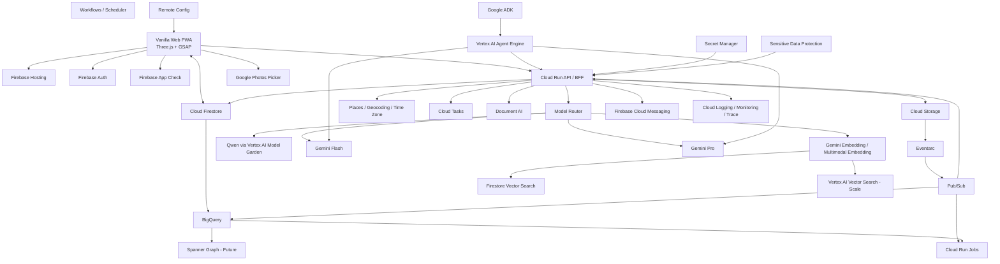

# Elsewhere Google-First Technical Architecture v1.0

**状态：** 产品技术总方案 / 技术栈唯一基线
**首次冻结：** 2026-07-15
**最近修订：** 2026-07-18（Module 5A Authoritative OCR Execution）
**适用对象：** 产品、前端、后端、AI、数据、隐私、安全、Coding Agent
**产品依据：** `Elsewhere_PRD_v3.0.md`、`Elsewhere_Visual_Design_System_v3.0.md`、`ELSEWHERE_PAGE_LOGIC_MAP_v1.md`

---

# 0. 结论先行

Elsewhere 建议采用：

> **Firebase 作为客户端产品底座，Google Cloud 作为后端与异步处理底座，Vertex AI 作为 AI 与 Agent 底座，Google Maps Platform 作为地点底座，BigQuery 作为分析与离线评估底座。**

基础、低风险、低成本的纯文本任务允许使用 **Qwen**，但必须通过 **Vertex AI Model Garden / MaaS** 部署或调用，避免额外建立另一套云基础设施。

## 0.1 最终技术栈摘要

| 层级 | 推荐技术 |
|---|---|
| Web 前端 | 现有 vanilla HTML/CSS/JS、Three.js、GSAP、SVG、Service Worker |
| Web 托管 | Firebase Hosting |
| 身份 | Firebase Authentication |
| 客户端防滥用 | Firebase App Check |
| 客户端实时数据 | Cloud Firestore |
| 原件与派生媒体 | Cloud Storage for Firebase / Google Cloud Storage |
| API / BFF | Cloud Run |
| 异步事件 | Eventarc + Pub/Sub |
| 精确任务队列 | Cloud Tasks |
| 批处理 | Cloud Run Jobs |
| 工作流编排 | Google Cloud Workflows + Cloud Scheduler |
| 文档/OCR | Document AI |
| 快速多模态理解 | Gemini Flash 级模型（当前建议别名指向 Gemini 3.5 Flash） |
| 深度推理 | Gemini Pro 级模型（当前建议别名指向 Gemini 3.1 Pro） |
| 基础低风险文本 | Qwen 3 系列，通过 Vertex AI Model Garden |
| Embedding | Gemini Embedding 2 + Vertex AI multimodal embeddings |
| MVP 向量检索 | Firestore Vector Search |
| 扩展向量检索 | Vertex AI Vector Search |
| Agent | Google ADK + Vertex AI Agent Engine |
| 地点识别 | Places API (New)、Geocoding API、Time Zone API |
| 用户照片选择 | Google Photos Picker API + 浏览器本地文件选择 |
| 产品分析 | Google Analytics for Firebase + BigQuery |
| 推送通知 | Firebase Cloud Messaging |
| 配置与模型路由 | Firebase Remote Config |
| 机密 | Secret Manager |
| 敏感信息识别 | Sensitive Data Protection |
| 日志与监控 | Cloud Logging、Monitoring、Trace、Error Reporting、Firebase Performance |
| CI/CD | GitHub + Cloud Build + Artifact Registry + Firebase Hosting / Cloud Run deploy |
| IaC | Terraform（Google provider） |
| 本地测试 | Firebase Emulator Suite + Playwright |

## 0.2 架构基本原则

1. **原件先保存，AI 后处理。**
2. **AI 永远不是第一步；确定性事实必须先编译为权威 RoutePlan。**
3. **Document AI、Places、Embedding、Gemini 等计费能力只能执行当前、输入匹配且预算有效的 approved RoutePlan。**
4. **结构化事实优先于生成式文本。**
5. **所有 AI 输出必须能够回到原始来源。**
6. **用户确认覆盖 AI 建议，但保留修改历史。**
7. **粒子和前端视觉只消费结构化数据，不自行创造业务事实。**
8. **所有私密原件和核心 AI 调用都走服务端，不从浏览器直接把用户内容发给模型。**
9. **Qwen 只承担基础、低风险、可替换任务；Gemini 与 Google 专用服务承担核心多模态、关系与 Agent 能力。**
10. **MVP 不上复杂图数据库；先用 Firestore 的对象与边集合，达到迁移阈值后再评估 Spanner Graph。**
11. **前端保持当前 vanilla 技术栈，不因云技术选型重写页面。**

---

# 1. 产品对象与数据真相

Elsewhere 的数据链固定为：

```text
Fragment 原始碎片
→ Entity 实体
→ Visit / Event 到访与事件
→ Context / Relation 脉络与连接
→ Discovery 发现
→ User Note 用户解释
→ City Capsule 策展回望
```

## 1.1 Firestore 推荐集合

所有用户数据默认放在用户作用域下：

```text
users/{uid}
├─ profile/main
├─ settings/main
├─ privacy/main
├─ modelPreferences/main
├─ fragments/{fragmentId}
├─ importBatches/{batchId}
├─ entities/{entityId}
├─ journeys/{journeyId}
├─ cities/{cityId}
├─ visits/{visitId}
├─ scenes/{sceneId}
├─ places/{placeId}
├─ connections/{connectionId}
├─ discoveries/{discoveryId}
├─ notes/{noteId}
├─ inboxItems/{itemId}
├─ agentSessions/{sessionId}
├─ exports/{exportId}
├─ modelRuns/{runId}
├─ auditEvents/{eventId}
└─ notificationItems/{notificationId}
```

## 1.2 原始碎片 Fragment

建议字段：

```json
{
  "id": "frag_xxx",
  "ownerId": "uid",
  "batchId": "batch_xxx",
  "type": "photo|receipt|ticket|screenshot|menu|text|audio",
  "storage": {
    "originalPath": "users/uid/originals/...",
    "thumbnailPath": "users/uid/thumbnails/...",
    "previewPath": "users/uid/previews/..."
  },
  "hashes": {
    "sha256": "...",
    "perceptualHash": "..."
  },
  "capturedAt": "...",
  "uploadedAt": "...",
  "timezone": "...",
  "exif": {},
  "ocr": {
    "rawText": "...",
    "processor": "document-ai",
    "status": "complete"
  },
  "geo": {
    "lat": 0,
    "lng": 0,
    "source": "exif|ocr|maps|user|ai",
    "status": "suggested|confirmed|unresolved"
  },
  "entityRefs": [],
  "journeyId": null,
  "sceneId": null,
  "placeId": null,
  "connectionIds": [],
  "discoveryIds": [],
  "embeddingRefs": {},
  "status": "uploaded|processing|placed|unresolved|failed",
  "privacy": {},
  "provenance": {},
  "createdAt": "...",
  "updatedAt": "..."
}
```

## 1.3 字段级来源 Provenance

每一个 AI 或系统生成字段都必须记录：

```json
{
  "value": "Common Grounds",
  "sourceType": "ocr|exif|gps|places|gemini|qwen|user",
  "sourceRefs": ["frag_1", "frag_2"],
  "modelAlias": "FAST_MULTIMODAL",
  "modelVersion": "...",
  "promptVersion": "place-resolution-v3",
  "confidence": 0.86,
  "status": "suggested|confirmed|corrected|rejected|conflicted",
  "createdAt": "..."
}
```

用户界面展示的是业务语言，但系统内部必须保留来源。

## 1.4 Connection

```json
{
  "id": "conn_xxx",
  "type": "same_event|sequential|repeated|cross_media|same_place|cross_trip|user_defined",
  "nodeRefs": [],
  "commonEntityRefs": [],
  "timeDistanceSeconds": 0,
  "spaceDistanceMeters": 0,
  "supportingEvidence": [],
  "contradictingEvidence": [],
  "status": "suggested|accepted_by_user|corrected_by_user|rejected_by_user|unresolved|conflicted",
  "score": 0,
  "modelRunId": "...",
  "version": 1
}
```

## 1.5 Discovery

```json
{
  "id": "disc_xxx",
  "type": "repetition|cross_trip|cross_media|sequence|absence|unresolved",
  "sourceFragmentIds": [],
  "connectionIds": [],
  "placeIds": [],
  "journeyIds": [],
  "systemTitle": "...",
  "userTitle": null,
  "factSummary": "...",
  "whySurfaced": [],
  "uncertainties": [],
  "qualityScore": 0,
  "status": "new|saved|named|ignored|unresolved",
  "modelRunId": "...",
  "version": 1
}
```

---

# 2. 总体云架构



---

# 3. 前端技术路径

## 3.1 当前决定

继续使用：

```text
vanilla HTML
vanilla CSS
vanilla JavaScript
Three.js
GSAP
SVG
Service Worker / PWA
Playwright
```

不因为接入 Firebase 或 Vertex AI 重写 React。

## 3.2 Firebase Web SDK

客户端允许直接使用：

- Firebase Authentication；
- Firestore 的用户可读写数据；
- Cloud Storage 的受规则保护上传；
- App Check；
- Remote Config；
- Analytics；
- Performance Monitoring；
- FCM。

核心 AI 调用、复杂数据变更、关系确认、删除影响、导出等必须走 Cloud Run。

## 3.3 前端状态分层

```text
Remote persistent state:
Firestore

Upload state:
Storage resumable upload + Firestore batch doc

Local transient state:
vanilla store

Offline queue:
IndexedDB + Service Worker

Visual derived state:
Three.js / GSAP scene state

Sensitive server state:
Cloud Run only
```

## 3.4 前端与数据驱动视觉

Three.js 不能读取写死 mock 值。

前端流程：

```text
Firestore snapshot
→ page selector
→ view model
→ DOM fragment anchors
→ anchor registry
→ particle layout
→ SVG relation paths
→ GSAP transition
```

所有城市数、碎片数、粒子团、连接和发现随数据变化。

---

# 4. 身份、权限与客户端安全

## 4.1 Firebase Authentication

推荐登录顺序：

1. 首次体验：匿名用户；
2. 用户准备跨设备同步时：绑定 Google 登录；
3. 可选：Apple、Email Link；
4. 高风险操作：重新认证。

匿名账户必须支持升级，不能因登录丢失本地世界。

## 4.2 App Check

Web 使用 reCAPTCHA Enterprise 提供方。

验证位置：

- Firestore；
- Cloud Storage；
- Cloud Run 自定义 API；
- Firebase AI Logic（如未来使用）。

App Check 不是身份验证，Cloud Run 仍要验证 Firebase ID Token。

## 4.3 Firestore / Storage Rules

路径必须按用户隔离：

```text
users/{uid}/...
users/{uid}/originals/...
users/{uid}/derived/...
```

客户端不能：

- 修改模型运行记录；
- 直接写 accepted connection；
- 批量删除派生图谱；
- 创建他人的分享链接；
- 修改权限审计。

这些由 Cloud Run Admin SDK 执行。

---

# 5. 原件导入与处理管线

## 5.1 输入来源

支持：

- 浏览器本地相册 / 文件；
- 相机；
- 粘贴文字；
- Google Photos Picker API；
- 后续系统分享入口；
- 后续音频。

## 5.2 上传流程

```text
用户选择
→ 客户端本地预览
→ 创建 importBatch
→ 获取上传会话
→ Cloud Storage resumable upload
→ Firestore 更新已保存数量
→ Storage finalize Event
→ Eventarc
→ 确定性事实处理
→ Authoritative Routing & Budget Gate
→ 仅调度 approved capability
```

## 5.3 原件优先

上传成功后立即写：

```text
fragment.status = uploaded
```

即使 AI 全部失败，原件仍可查看。

## 5.4 异步服务拆分

推荐 Cloud Run 服务：

```text
api-bff
ingestion-coordinator
media-metadata-service
authoritative-routing-service
document-extraction-service
visual-understanding-service
place-resolution-service
embedding-service
visit-clustering-service
connection-service
discovery-service
else-tool-service
export-service
notification-service
privacy-delete-service
```

MVP 可以部署在较少 Cloud Run 服务中，但代码模块保持边界，避免一个巨型服务。

## 5.5 每个 Fragment 的任务

```text
1. Exact dedupe: SHA-256
2. Near duplicate: dHash candidate
3. EXIF / basic metadata
4. Thumbnail / preview generation
5. Routing cohort resolution and representative selection
6. Per-capability RoutePlan and budget approval
7. Approved Document AI extraction
8. Approved Gemini visual context extraction
9. Approved place candidate resolution and time zone normalization
10. Approved embeddings
11. Entity creation
12. Visit / scene clustering
13. Connection candidate generation
14. Discovery update
15. Import receipt and Inbox update
```

## 5.6 任务系统分工

### Eventarc
响应 Storage / Firestore 等事件。

### Pub/Sub
广播可重放的领域事件：

```text
fragment.uploaded
fragment.extracted
fragment.placed
visit.updated
connection.updated
discovery.created
batch.completed
```

### Cloud Tasks
需要精确重试和速率限制的单项任务：

- 模型调用；
- OCR；
- Places 请求；
- 导出；
- 删除；
- 通知。

### Cloud Run Jobs
批处理：

- 重新生成 embeddings；
- 历史数据回填；
- Capsule 重建；
- 大批量导出；
- 发现周期重算；
- 模型升级迁移。

## 5.7 Authoritative Routing & Budget Gate

Module 4.5 位于确定性事实与所有计费处理器之间：

```text
Original Save
→ Deterministic Facts
→ draft RoutePlan
→ cohort resolution / Representative Selector
→ per-capability Budget Gate
→ approved RoutePlan
→ Capability Executors
```

Router 只消费 source descriptor、格式、metadata、GPS/时间是否存在、SHA-256、dHash、重复候选、
bounded thumbnail、批次上下文、用户确认和已有结果。它不得调用 Document AI、Places、
Embedding、Gemini、Qwen、ML Kit 或外部分类 API。

RoutePlan 分别审批 OCR、Places、Embedding 和 Gemini，不保存笼统 `needsAI`。approved 决策正文
不可原地修改；Processor 只能返回结构化不足/升级请求，由 Router 生成新 revision。exact/near
duplicate 与 burst 的 supporting Fragment 仍完整保留，只跳过计划中明确未批准的昂贵处理。

预算采用 capability 级预留—结算：批准时按成本模型版本预留 ceiling，执行后记录实际成本并释放
余额。预算不足产生 blocked decision，不把 Fragment 标记为失败。完整领域契约见
`docs/superpowers/specs/2026-07-17-authoritative-routing-budget-gate-design.md`。

## 5.8 Module 5A：受权威计划约束的 OCR

当前只落地 OCR executor，链路为：

```text
current approved OCR RoutePlan
→ deterministic named Cloud Task
→ private capability-worker
→ generation-pinned original
→ fixed-version Enterprise Document OCR
→ immutable private artifacts / CapabilityResult
→ atomic budget settlement and suggested facts
```

API、ingestion 和 capability-worker 共用镜像但使用三个互斥 composition root、三个 runtime service
account 与三个 IAM 边界。只有 ingestion 构造 Cloud Tasks，只有 worker 构造 Document AI；默认
fake mode 两者均零构造、零调用。task header 只用于观测，worker 从 Firestore 当前状态重新授权，
不信任 payload 中的计划副本。

OCR policy v2 只允许 bounded JPEG/PNG/WebP。历史允许 PDF planning 的 policy v1 不可直接执行，
因为当前 decoder 不能可靠提供 PDF pageCount；必须重新路由且不得伪造页数。provider 调用后若
计费结果不确定，进入 `billing_uncertain` 并停止自动重试。详情与运维配置见
`docs/implementation/capability-execution-ocr-v1.md`。

Module 5A 不实现 Places、Embedding、Gemini、地图 grounding 或恶意内容扫描。任何 OCR 结果不足
只能提交 escalation request，由 Module 4.5 生成新 RoutePlan revision。

---

# 6. AI 模型路由

本节只描述**已获 RoutePlan 授权后**如何在模型别名之间选择。它不是 ingestion 的
Authoritative Routing Layer，也无权增加未被 RoutePlan 批准的 capability。

不要在业务代码中写死模型 ID。

统一使用别名：

```text
BASIC_TEXT
FAST_MULTIMODAL
DEEP_REASONING
TEXT_EMBEDDING
MULTIMODAL_EMBEDDING
LIVE_ASSISTANT
```

真实模型在 Remote Config / 服务端配置中管理。

## 6.1 当前推荐路由

| 别名 | 当前推荐 | 任务 |
|---|---|---|
| BASIC_TEXT | Qwen 3 Next Instruct（Vertex AI Model Garden MaaS） | 低风险文本清理、标签规范化、标题候选、JSON 修复 |
| FAST_MULTIMODAL | Gemini 3.5 Flash | 图片/截图理解、菜单/票据上下文、批量候选生成 |
| DEEP_REASONING | Gemini 3.1 Pro | 冲突分析、发现筛选、跨旅程推理、Capsule、复杂 Else |
| TEXT_EMBEDDING | Gemini Embedding 2 | 文本语义检索 |
| MULTIMODAL_EMBEDDING | Vertex AI multimodal embeddings | 图像与文本相似度、去重、跨媒介检索 |
| LIVE_ASSISTANT | Gemini Omni Flash / Live 级模型，P2 | 实时语音或现场查询 |

模型名称会变化，所以生产代码只能依赖别名。

## 6.2 Qwen 使用边界

Qwen 允许处理：

- 语言检测；
- 文本标准化；
- 简单标签；
- OCR 文本清理；
- 简短标题候选；
- 结构化 JSON 修复；
- 非关键 query classification。

Qwen 不负责：

- 最终地点确认；
- 用户关系确认；
- 发现质量门槛；
- 未决/冲突裁决；
- 情绪判断；
- 最终 Else 高风险回答；
- 删除影响；
- 隐私决策。

建议先对输入做字段裁剪与敏感信息去除，再发送 Qwen。

## 6.3 Document AI 与 Gemini 的分工

### Document AI
负责可重复、结构化文档提取：

- 小票；
- 发票；
-票据；
- 表格；
- 通用 OCR；
- 布局。

### Gemini Flash
负责文档上下文：

- 这是菜单还是票据；
- 商户与城市候选；
- 截图含义；
- 图片中的场景和对象；
- 跨媒介候选关系。

### Gemini Pro
负责：

- 多证据冲突；
- 非平凡关系；
- 发现是否值得打扰；
- Capsule 的克制策展；
- 复杂 Else 问答。

---

# 7. 地点与地图技术

## 7.1 地点解析顺序

```text
EXIF GPS
→ OCR 地址 / 商户
→ 用户批次上下文
→ Places API 候选
→ Geocoding
→ 历史用户先验
→ Gemini 辅助消歧
→ 用户确认
```

不得直接让 LLM 猜地点。

## 7.2 Google Maps Platform

### Places API (New)
- 商户/地点搜索；
- Place ID；
- 地点详情；
- 地点照片；
- 地址组件。

### Geocoding API
- 地址与坐标转换。

### Time Zone API
- 将 UTC / 坐标统一为当地时间。

### Maps JavaScript API
- 时间、地点和城市视图的地图底层。

### Grounding with Google Maps
仅用于 Else 的受控地点解释，必须与“用户原始证据”分开展示。

## 7.3 地点缓存

Places 返回数据保存：

```text
placeId
displayName
formattedAddress
location
types
timezone
retrievedAt
```

遵守 Google Maps Platform 的缓存和展示要求，避免无期限保存禁止缓存字段。

---

# 8. Embedding、检索与图谱

## 8.1 Embedding 生成

每个 Fragment 可拥有：

```text
textEmbedding
imageEmbedding
combinedEmbedding
```

文本来源：

- OCR；
- 用户文字；
-结构化地点；
- 场景摘要。

图像 embedding 用于：

- 近重复；
- 相似场景；
- 跨旅程视觉呼应；
- 无文字搜索。

## 8.2 MVP：Firestore Vector Search

MVP 使用：

- Firestore 结构化过滤；
- Firestore vector nearest-neighbor；
- 用户作用域；
- 服务器端混合排序。

## 8.3 扩展：Vertex AI Vector Search

触发迁移条件：

- 单用户数十万 embeddings；
- 全局索引规模明显增长；
- 需要低延迟多模态混合检索；
- Firestore 索引成本或限制成为瓶颈。

## 8.4 图谱

MVP 将图谱保存为：

```text
entities
visits
connections
discoveries
```

Connection 是显式边。

## 8.5 Spanner Graph 迁移条件

P2 才评估：

- 多跳图查询成为核心；
- 需要城市/旅程/地点/关系复杂遍历；
- Firestore 多次读取成本过高；
- 图规模和一致性要求上升；
- 需要图查询语言和横向扩展。

不要为了“产品像图谱”在 MVP 直接上 Spanner Graph。

---

# 9. 发现系统

## 9.1 两阶段设计

### 阶段一：确定性候选

Cloud Run 代码生成：

- 相同地点；
- 时间接近；
- 跨媒介；
- 重复出现；
- 前后相连；
- 跨旅程相似；
- 缺少证据。

### 阶段二：AI 筛选

Gemini 判断：

- 非平凡性；
- 证据完整度；
- 新颖性；
- 是否重复；
- 是否值得通知；
- 是否过度解释。

LLM 不能直接从全部原件自由生成发现。

## 9.2 发现质量门槛

建议持久化：

```text
evidenceStrength
novelty
crossDateScore
crossMediaScore
crossTripScore
redundancyPenalty
userInterestPrior
uncertaintyPenalty
finalQualityScore
```

## 9.3 发现输出

必须保存：

- 原件来源；
- 连接来源；
- 共同实体；
- 为什么显影；
- 缺口；
- 模型与 prompt 版本；
- 用户状态。

---

# 10. Else Agent 架构

## 10.1 推荐技术

```text
Google ADK
+ Vertex AI Agent Engine
+ Cloud Run tool services
+ Gemini model router
```

## 10.2 Else 不是开放聊天

Agent 的系统边界：

- 只能访问当前用户数据；
- 默认继承当前页面范围；
- 不默认搜索开放互联网；
- 所有事实答案必须有来源；
- 无证据时明确说明；
- 不替用户判断情绪。

## 10.3 Agent 工具

```text
get_current_scope
search_fragments
search_places
search_scenes
search_connections
search_discoveries
vector_search
graph_traverse
open_source
filter_fragment_field
focus_map_or_timeline
propose_relation_change
confirm_relation
reject_relation
keep_unresolved
create_user_note
export_object
```

## 10.4 查询流程

```text
问题
→ Scope Resolver
→ Query Router
→ Structured Retrieval
→ Vector Retrieval
→ Graph Retrieval
→ Evidence Pack
→ Gemini Synthesis
→ Source Validation
→ Stream Answer
→ 用户打开来源
```

## 10.5 模型路由

- 简单意图识别：Qwen / Flash；
- 单对象回答：Flash；
- 跨城市、多来源、冲突：Pro；
- 不需要生成式回答时直接返回结构化结果。

## 10.6 Agent Session

只保存：

- 用户问题；
- 当前范围；
- 引用对象；
- 回答；
- 模型版本；
- 用户是否继续；
- TTL / 删除状态。

不将会话作为产品主数据库。

## 10.7 前端通信

Cloud Run 使用：

- SSE：文本与来源逐步返回；
- WebSocket：仅未来实时语音/现场模式；
- 普通 REST：工具动作和确认。

---

# 11. 页面与技术栈完整覆盖

## 11.1 首次使用

| 页面 | 前端 | Google 服务 | AI / 后端 |
|---|---|---|---|
| 价值说明 | Hosting、Remote Config | Analytics | 无模型必需 |
| 权限说明 | Auth、App Check | Firestore settings | Cloud Run 保存权限版本 |
| 首次导入 | Photos Picker、本地文件、Storage | Storage、Firestore | Cloud Run 创建 Batch |
| Processing | Firestore realtime | Eventarc、Pub/Sub、Tasks | Document AI、Flash、embeddings |
| 第一条关系 | Firestore connection | Cloud Run | Pro/Flash 生成可解释证据 |

## 11.2 世界

| 页面 | 数据 | Google 服务 | AI |
|---|---|---|---|
| 世界首页 | cities、worldStats、batches、discoveries | Firestore、Maps JS | 无需实时 LLM |
| 城市列表 | cities、journeys | Firestore、Maps | 城市摘要预计算 |
| 城市世界 | clusters、fragments、places、connections | Firestore、Storage、Maps | 预计算聚类 |
| 全部碎片 | fragments、vectors、connections | Firestore、Vector Search、Storage | Embedding、Else |
| Fragment Lens | fragment 与所有引用 | Firestore、Storage | 不实时生成事实 |
| 原件查看 | original object | Storage signed/read URL | 无 |
| Import | importBatch | Photos Picker、Storage | 无 |
| Import Receipt | batch result | Firestore realtime | Flash/Pro 预计算摘要 |
| Inbox | inboxItems、connections | Firestore、Cloud Run transaction | Pro/规则解释 |
| Capsule | scenes、discoveries、notes | Firestore、Storage | Pro 策展，来源绑定 |

## 11.3 城市探索

| 页面 | 数据 | Google 服务 | AI |
|---|---|---|---|
| Time | visits、scenes、timezone | Firestore、Time Zone API | 重复节奏预计算 |
| Place | places、visits | Places、Maps JS、Firestore | 地点候选消歧 |
| Connection | connections | Firestore / P2 Graph | 无需实时 LLM |
| Scene Detail | scene、fragments | Firestore、Storage | 克制观察预计算 |
| Place Detail | place、visits、fragments | Places、Maps、Firestore | 跨旅程模式 |
| Connection Detail | connection、evidence | Firestore、Cloud Run | 冲突解释 Pro |

## 11.4 发现

| 页面 | 数据 | Google 服务 | AI |
|---|---|---|---|
| Discover Home | discoveries | Firestore | Discovery service 预计算 |
| Discover Detail | evidence、connections、sources | Firestore、Storage | Pro 筛选与解释 |
| Cross-trip | journeys、embeddings | Vector Search、BigQuery | Pro |
| Unresolved | candidates、missingEvidence | Firestore | Pro/规则 |
| Saved / Named | user states | Firestore | 无 |

## 11.5 Else

| 页面 | Google 服务 | 技术 |
|---|---|---|
| Quick Sheet | Cloud Run + Firestore | SSE、scope inheritance |
| Answer | ADK + Agent Engine | Gemini router + tools |
| Sources | Firestore / Storage / Maps | 结构化结果 |
| History | Firestore TTL | 私有会话索引 |

## 11.6 档案 / 搜索

| 页面 | 服务 |
|---|---|
| Archive | Firestore structured queries |
| Search | Firestore filters + vector search |
| Filter | Firestore compound indexes |
| Bulk manage | Cloud Run transactional API + Tasks |

## 11.7 我的

| 页面 | Google 服务 |
|---|---|
| Me Home | Firestore counters |
| Writing | Firestore + Storage attachments |
| Writing Detail | Firestore transaction |
| Privacy | Firestore settings + Rules metadata |
| Source Permissions | Auth / Photos Picker / App settings |
| Storage | Cloud Run usage aggregator + Storage metadata |
| AI Preferences | Remote Config defaults + Firestore override |
| Notifications | FCM + Firestore |
| Export/Delete | Cloud Run Jobs + Workflows + Storage |
| App Lock | Firebase Auth reauth + client local lock |

## 11.8 公共流程

| 流程 | 服务 |
|---|---|
| 分享预览 | Cloud Run render/export + Storage temporary object |
| 编辑时间地点 | Cloud Run transaction + reprocessing Pub/Sub |
| 合并事件 | Cloud Run transaction |
| 拆分事件 | Cloud Run transaction |
| 冲突处理 | Firestore + Pro explanation |
| 删除影响 | Cloud Run graph impact analysis |
| 生成历史 | Firestore modelRuns / auditEvents |
| 重复处理 | Hash + multimodal embedding |
| 空状态 | 客户端 / Firestore |
| 错误重试 | Tasks retry + DLQ + user-visible status |

---

# 12. BigQuery 与产品分析

## 12.1 数据来源

- Firebase Analytics export；
- Cloud Run structured events；
- Pub/Sub pipeline events；
- modelRuns；
- cost metadata；
- discovery outcomes；
- user corrections。

## 12.2 BigQuery 用途

- 漏斗；
- 激活与留存；
- 导入批次质量；
- OCR / 模型准确率；
- 发现保存率；
- Else 来源打开率；
- 模型成本；
- Prompt / 模型版本比较；
- 离线 discovery candidate mining；
- 评估数据集。

## 12.3 不进入 BigQuery 的内容

默认不把完整原件和完整私人文字复制进分析仓库。

只存：

- 匿名或用户作用域 ID；
- 结构化事件；
- 模型质量指标；
- 对象数量；
- 操作结果；
- 脱敏标签。

---

# 13. 通知

使用 Firebase Cloud Messaging。

允许触发：

- 高价值发现；
- 冲突待确认；
- 批次处理完成；
- Capsule 形成；
- 用户设置的未来信件。

禁止：

- 每日普通回忆；
- 为活跃度制造发现；
- 未达到质量门槛的推送。

通知由：

```text
domain event
→ notification-service
→ user preferences
→ rate limit
→ FCM
```

---

# 14. 隐私与安全

## 14.1 项目隔离

至少三个 Google Cloud 项目：

```text
elsewhere-dev
elsewhere-staging
elsewhere-prod
```

数据、Storage bucket、模型日志完全分离。

## 14.2 区域

在正式发布市场确定后，选择一个主区域，并尽量共置：

- Firestore；
- Storage；
- Cloud Run；
- Vertex AI；
- Document AI；
- BigQuery。

不要先在不同大洲随意创建资源。

## 14.3 服务账号

每个 Cloud Run 服务使用独立 service account，最小权限。

禁止使用全能默认服务账号。

## 14.4 Secret Manager

保存：

- 第三方 key；
- signing secrets；
- webhook secret；
- export signing key。

Maps 浏览器 key 通过 HTTP referrer 限制，不当作服务端 Secret。

## 14.5 Sensitive Data Protection

用途：

- 导出前扫描；
- 日志脱敏；
- 票据金额、地址、邮箱、电话识别；
- 分享默认隐藏敏感字段。

## 14.6 日志

禁止日志记录：

- 完整图片；
- 完整 OCR；
- 完整用户笔记；
- 未脱敏模型 prompt；
- signed URL。

记录：

- object ID；
- trace ID；
- model alias；
- latency；
- token / cost；
- status；
- error class。

## 14.7 删除

删除账户使用 Workflows：

```text
冻结写入
→ 计算影响
→ 导出可选
→ 删除 Storage
→ 删除 Firestore 子集合
→ 删除 embeddings / vector
→ 删除 agent sessions
→ 删除 analytics user mapping
→ 写审计完成
```

---

# 15. 可观察性与评估

## 15.1 Cloud Monitoring

仪表盘：

- API latency；
- upload success；
- task backlog；
- Pub/Sub oldest unacked；
- model error / 429；
- Document AI latency；
- Places error；
- Firestore reads/writes；
- Storage usage；
- discovery throughput；
- Else latency。

## 15.2 Trace

一批导入使用统一 trace：

```text
batchId
fragmentId
modelRunId
```

## 15.3 AI Eval

建立评估集：

- OCR；
- place resolution；
- scene clustering；
- same-event relation；
- discovery relevance；
- Else answer grounding；
- emotion-inference violation；
- source correctness。

任何模型切换必须跑回归集。

---

# 16. 配置与模型切换

使用服务端配置为主，Remote Config 为客户端展示与实验。

建议配置：

```json
{
  "models": {
    "BASIC_TEXT": "...",
    "FAST_MULTIMODAL": "...",
    "DEEP_REASONING": "...",
    "TEXT_EMBEDDING": "...",
    "MULTIMODAL_EMBEDDING": "..."
  },
  "features": {
    "crossTripDiscoveries": true,
    "liveElse": false,
    "mapsGrounding": false
  },
  "thresholds": {
    "autoPlace": 0.9,
    "autoConnection": 0.93,
    "discoveryNotification": 0.85
  }
}
```

模型别名不能由 Web 客户端任意修改。

---

# 17. CI/CD 与环境

## 17.1 本地

- Firebase Emulator Suite；
- fake Cloud Storage fixtures；
- mock Vertex AI adapter；
- Playwright；
- golden AI outputs；
- local Three.js visual tests。

## 17.2 CI

```text
lint
→ unit tests
→ Firestore rules tests
→ Storage rules tests
→ API integration
→ Playwright
→ AI regression sample
→ build
→ staging deploy
```

## 17.3 部署

### 前端
Firebase Hosting preview channel → production.

### 后端
Cloud Build → Artifact Registry → Cloud Run staging → production.

### Schema / Index
Firestore indexes 和 Rules 随仓库版本管理。

### IaC
Terraform 管理：

- projects；
- APIs；
- service accounts；
- buckets；
- Cloud Run；
- Pub/Sub；
- Eventarc；
- Tasks；
- BigQuery；
- Secret Manager；
- monitoring alerts。

---

# 18. 成本控制

## 18.1 模型路由

- 所有计费能力先经过 Authoritative Routing & Budget Gate；
- Router 自身不调用模型或付费分类器；
- exact/near duplicate 与 burst 优先只处理 representative；
- OCR 足够时不得继续自动升级 Gemini；
- 能用确定性代码，不调用模型；
- 能用 Qwen，不调用 Gemini Pro；
- 能用 Flash，不调用 Pro；
- Pro 只用于高价值发现、冲突和复杂 Else；
- embeddings 只生成一次，数据变化才重算。

## 18.2 批处理

- 历史 re-embedding 用 batch；
- discovery 周期任务用 Jobs；
- 相同 prompt context 使用缓存；
- OCR 结果持久化；
- Places 结果按规则缓存。

## 18.3 前端

- 缩略图而非原件；
- LOD；
- Firestore query limit；
- 分页；
- 只订阅当前页面；
- 粒子不触发数据库读取。

## 18.4 预算

- Cloud Billing budgets；
- Billing export to BigQuery；
- 模型调用添加 user/batch/feature labels；
- 每项功能计算单位成本。

---

# 19. 分阶段实施

## P0：比赛 / MVP

使用：

- Firebase Hosting；
- Auth；
- App Check；
- Firestore；
- Storage；
- Cloud Run；
- Eventarc；
- Pub/Sub；
- Cloud Tasks；
- Document AI；
- Gemini Flash / Pro；
- Qwen 基础任务；
- Firestore Vector Search；
- Places / Geocoding / Time Zone；
- BigQuery；
- FCM；
- Secret Manager；
- Authoritative Routing & Budget Gate。

完成：

- 导入；
- 处理；
- 代表项选择、分项预算与权威执行计划；
- 城市；
- Fragment Field；
- Lens；
- Inbox；
- Time / Place / Connection；
- Discover；
- Else；
- Writing；
- Privacy / Export。

## P1：生产增强

- ADK + Agent Engine；
- Vertex AI Vector Search；
- Workflows；
- Remote Config / A/B；
- Sensitive Data Protection；
- Cloud KMS / CMEK；
- 更完整 AI Eval；
- Google Photos Picker；
- Cloud Run Jobs 回填；
- 跨旅程发现。

## P2：规模化

- Spanner Graph；
- Dataflow；
- 多区域灾备；
- Provisioned Throughput；
- Live / Voice Else；
- 原生移动客户端；
- 更复杂年度回望。

---

# 20. 不推荐的技术路径

## 不推荐 1：浏览器直接调用核心 Gemini

原因：

- 用户原件私密；
- 无法可靠控制工具权限；
- 模型 key / abuse 风险；
- 审计和版本困难。

核心 AI 放 Cloud Run / Agent Engine。

## 不推荐 2：MVP 直接使用 Spanner Graph

复杂度和成本过高，先用 Firestore Connection 边。

## 不推荐 3：所有任务都使用 Gemini Pro

成本高、延迟高，也不必要。

## 不推荐 4：全部逻辑写入一个 Cloud Function

处理管线需要队列、重试、批处理和版本控制，使用 Cloud Run 模块化服务。

## 不推荐 5：用 BigQuery 当产品在线数据库

BigQuery 用于分析、离线挖掘和评估，不用于用户页面实时状态。

## 不推荐 6：前端视觉直接依赖模型输出

Three.js 只消费验证过的结构化对象，不能读取 LLM 自由文本决定粒子位置。

---

# 21. 完整性检查

任何技术方案完成前，逐项回答：

## 产品覆盖

- Onboarding 是否有服务？
- Import / Processing / Receipt / Inbox 是否闭环？
- World / City / Fragment Field 是否使用同一数据？
- Time / Place / Connection 是否有结构化对象？
- Discover 是否从 Connection 生成？
- Else 是否能回到来源？
- Writing 是否关联对象？
- Privacy / Export / Delete 是否真实可执行？
- Merge / Split / Conflict / Duplicate 是否有服务？

## 数据

- 原件在哪？
- 派生对象在哪？
- 向量在哪？
- 关系在哪？
- 用户修正在哪？
- 模型版本在哪？
- 删除影响如何计算？

## AI

- 是否存在当前、输入匹配且预算有效的 approved RoutePlan？
- 这个任务为什么需要模型？
- 使用 Qwen、Flash 还是 Pro？
- 输出是否结构化？
- 是否有来源？
- 是否有评估集？
- 失败如何回退？

## 安全

- 客户端能否越权？
- App Check 是否验证？
- 是否记录敏感日志？
- 删除是否完整？
- 分享是否默认脱敏？

## 运行

- 如何重试？
- 如何幂等？
- 如何监控？
- 如何控制成本？
- 如何升级模型？
- 如何回滚？

---

# 22. 最终技术纪律

> **Firebase 负责用户可感知的产品状态。**

> **Cloud Run、Eventarc、Pub/Sub 和 Tasks 负责可靠处理。**

> **AI 永远不是第一步；所有计费能力必须服从 Authoritative Routing & Budget Gate。**

> **Document AI 提取文档事实，Gemini 理解多模态与复杂关系，Qwen 只处理基础低风险文本。**

> **Firestore 是 MVP 业务真相，Cloud Storage 是原件真相，BigQuery 是分析真相。**

> **Else 通过 ADK / Agent Engine 调用受控工具，而不是自由访问用户数据。**

> **每个 AI 事实都要有来源、状态、版本和用户修正通道。**

> **视觉层永远消费数据，不创造数据。**
