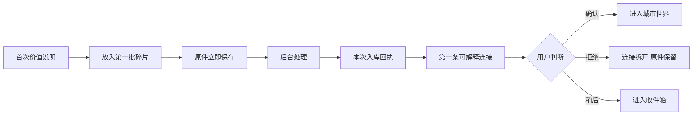
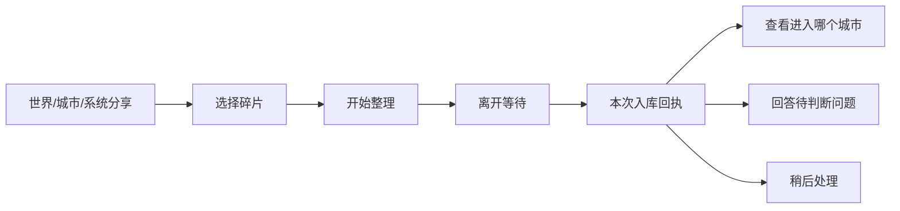
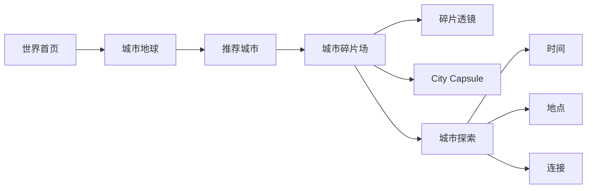
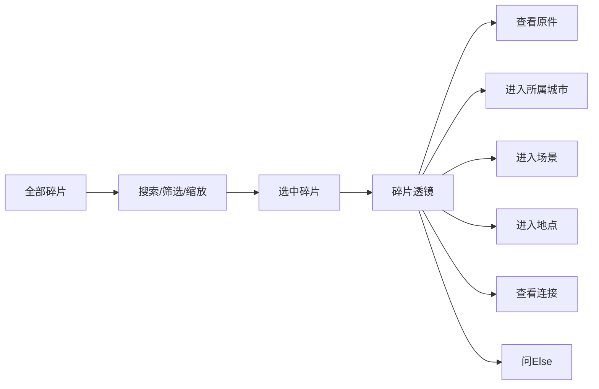
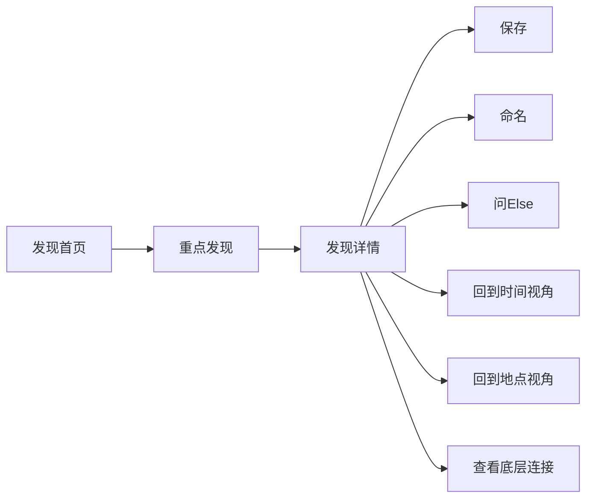

# Elsewhere PRD v3.0 — 私人旅行世界 / 碎片数据库 / 主动发现

**状态：** 信息架构重构后的产品主文档
**日期：** 2026-07-13
**文档优先级：** 高于旧版 PRD、旧页面结构和单页视觉稿
**适用对象：** 产品经理、UX、视觉设计、前端、AI/数据工程、Codex/Claude Code 等 Coding Agent
**配套文档：** [`Elsewhere_Visual_Design_System_v3.0.md`](./Elsewhere_Visual_Design_System_v3.0.md) · [`ELSEWHERE_PAGE_LOGIC_MAP_v1.md`](./ELSEWHERE_PAGE_LOGIC_MAP_v1.md) · [`DESIGN_BRIEF.md`](./DESIGN_BRIEF.md) · [`AGENTS.md`](./AGENTS.md)

---

# 0. 本版最重要的结构修订（必须先读）

本版不是在旧结构上增加页面，而是重新确定 Elsewhere 的产品骨架。任何设计与编码必须先遵守下列结论。

## 0.1 一级产品结构固定为四个核心空间

```text
世界 World
发现 Discover
Else（跨页面悬浮助手，不是普通完整页面）
我的 Me
```

### 四个空间的职责

| 空间 | 用户的根本意图 | 负责的内容 | 明确不负责 |
|---|---|---|---|
| 世界 | 看见、进入和管理自己的旅行世界 | 城市、全部碎片、导入、入库状态、收件箱、时间/地点/连接结构 | 不替用户挑选“什么最值得看” |
| 发现 | 看 Else 新显影了什么 | 少量高价值、非平凡的发现及其支撑碎片集合 | 不复制一套场景/地点/关系数据库 |
| Else | 我明确想找、问或解释某件事 | 继承当前页面上下文，查询、解释、筛选、返回来源 | 不做独立内容社区，不做通用聊天 |
| 我的 | 我如何解释、控制和拥有这个世界 | 用户书写、命名、隐私、存储、表达偏好、导出与删除 | 不重复城市回望或发现信息流 |

## 0.2 “档案”不再是一级导航，也不再独立建设城市档案

旧版的“档案”容易退化成普通素材管理器，并与世界、城市、搜索重复。

本版统一为：

> **全部碎片 / Fragment Field**

它属于“世界”数据层，是全局数据库的可视化入口。城市中的“所有碎片”只是同一个页面的城市筛选状态，不再另建“城市档案”。

## 0.3 世界板块固定包含五个核心能力

1. **城市列表 / 城市地球**：整个私人旅行世界的空间索引；
2. **城市入口 / 城市世界**：最近或当前旅行的深入入口；
3. **全部碎片**：以碎片为中心的总数据库与可视化场；
4. **放入碎片**：低摩擦提交通道；
5. **碎片收件箱**：提交后的状态、回执、判断与异常中心。

它们不是全部平铺在世界首页，而是世界板块中的不同页面与流程。

## 0.4 新增两个关键交付物

### A. 本次入库回执

用户提交碎片后，系统必须明确交付：

- 放入了多少内容；
- 识别了哪段旅程；
- 找到了哪些地点；
- 建立了哪些连接；
- 有哪些内容需要判断；
- 有哪些重复、失败或冲突。

不能只让用户看到“处理中”或几条待确认问题。

### B. 碎片透镜 Fragment Lens

用户从任何页面点击碎片，都先进入同一个权威数据视图：

- 时间；
- 地点；
- 所属旅程；
- 所属场景；
- 参与关系；
- 用户文字；
- 来源和状态；
- 修改入口；
- “查看原件”。

点击“查看原件”后，才进入照片、小票或截图的完整原始内容。

同一碎片不能因入口不同而打开不同的互相矛盾页面。

## 0.5 城市页面重新收束为“城市世界”

城市首页不再同时平铺 City Capsule、场景、脉络、地点、关系、档案、发现等六七个入口。

城市世界只提供两个主方向：

1. **回到这座城市 / City Capsule**：策展阅读与记忆回望；
2. **探索这段旅程 / City Explore**：数据结构与旅行展开方式。

“城市探索”再分为三个视角：

```text
时间 Time
地点 Place
连接 Connections
```

- 原“场景”和“脉络”合并进入“时间”视角；
- 地点保留为“地点”视角；
- 关系改为“连接”视角；
- 独立城市档案删除，复用“全部碎片”的城市筛选。

## 0.6 发现板块不得复制第二套数据库

发现板块只有两层核心结构：

1. **发现首页**：少量高价值发现的汇总与筛选；
2. **发现详情**：一条发现及其支撑碎片关系场。

“跨旅程、未决、已保存”是发现类型或筛选状态，不需要各自建设独立页面体系。

发现详情可以深链回：

- 时间视角；
- 地点视角；
- 底层连接；
- 场景详情；
- 碎片透镜。

但这些权威对象页只属于“世界”数据层，不能在发现下复制。

## 0.7 Else 是跨层悬浮交互，不是第五个普通页面

Else 的默认形态：

- 一级页面：锚定在底部中央的 Orb；
- 二级页面：吸附页面边缘的上下文助手；
- 点击后：打开约 40% 高度的快速抽屉；
- 提问后：扩展为约 70%–75% 的回答层；
- 复杂查询时：允许进入临时的完整回答状态，但不形成常驻一级页面。

Else 的最终职责是把用户送回真实对象与来源，而不是留在聊天里。

## 0.8 产品最底层的对象链固定为

```text
原始碎片
→ 实体
→ 到访 / 事件
→ 时间、地点与连接结构
→ 高价值发现
→ 用户解释
```

所有页面都必须知道自己服务的是哪一层，禁止把所有对象做成同一种图片卡片。

---

# 1. 产品定义

## 1.1 一句话定义

> **Elsewhere 把旅行中散落的照片、小票、菜单、截图、票据和文字，组织成一个可以浏览、查询、纠正并持续显影新联系的私人旅行世界。**

## 1.2 产品本质

Elsewhere 同时是：

- 一个低摩擦的旅行碎片入口；
- 一个以原始证据为核心的私人旅行数据库；
- 一个按城市、时间、地点与关系展开的个人旅行世界；
- 一个会主动筛选非平凡联系的 AI 发现系统；
- 一个始终能回到来源的上下文查询助手；
- 一个把最终意义交还给用户的私人书写空间。

## 1.3 产品不是什么

Elsewhere 不是：

- AI 自动游记生成器；
- 普通相册或照片美化产品；
- 旅行规划、导航和攻略产品；
- 记账、报销或消费排行工具；
- 普通文件夹、云盘或素材管理器；
- 大模型聊天套壳；
- 自动分析用户情绪、人格、疗愈或成长的工具；
- 公开旅行社区；
- 依靠随机星空、霓虹和散文制造“高级感”的暗黑 AI Dashboard。

## 1.4 第一性原理

旅行碎片的价值不是单个文件，而是它们之间能够恢复的上下文。

一张照片保留视觉，一张小票保留交易，一张地图截图保留路径，一张菜单保留当时可见的信息。单独看，它们通常只是散落的数字残留；当时间、地点、商户、文字、视觉和用户补充被重新对齐时，它们才可能恢复为：

- 一次具体到访；
- 一段时间与空间的展开；
- 多次反复出现的日常；
- 一张票据与一张照片之间的连续；
- 不同旅行之间的事实呼应；
- 一个用户多年后仍能查询和解释的私人历史节点。

Elsewhere 的价值公式是：

> **低摩擦投入 × 原件长期存在 × 可追溯组织 × 非平凡发现 × 上下文查询 × 用户最终解释权**

---

# 2. 用户与需求

## 2.1 主用户

### 高频产生旅行碎片、低频主动整理的人

典型情境：

- 独自旅行；
- 留学、交换、旅居；
- 频繁短途旅行；
- 在新城市逐步形成生活半径；
- 喜欢保留照片、小票、菜单和截图，但不持续写日记；
- 希望以后找回具体细节，而不是只看一组精选照片。

重要修正：

- “敏感”“文艺”不是用户资格；
- 艺术感是产品表达方式，不是用户必须具备的性格；
- 需求成立的关键是异构碎片多、整理带宽低、以后有找回和理解需求。

## 2.2 核心 Jobs to Be Done

### Job A：先放进去

> 当我旅行时遇到一张以后可能有用的照片、票据、菜单或截图，我想先把它扔进一个地方，不需要建立文件夹、填写城市和写说明。

### Job B：知道系统做了什么

> 当我提交一批碎片后，我想立刻知道它们被保存在哪里、系统识别出了什么、连接了什么，以及还有哪些地方需要我判断。

### Job C：从整个世界中找东西

> 当我想找一家店、一张票、一次渡船或某个模糊日期时，我想通过浏览或提问找到它，并回到原始证据。

### Job D：进入一座城市

> 当我重新打开一段旅行时，我希望先看到这座城市由哪些碎片组成，再选择回望故事、按时间展开、按地点查看或理解连接。

### Job E：发现原来没注意到的联系

> 当数据积累后，我想看到重复出现、跨媒介补全、前后连续或跨旅程呼应，而不是只得到标签和自动摘要。

### Job F：保留自己的解释

> 当系统展示事实之后，我想自己命名、补充和解释，而不是让 AI 告诉我当时孤独、快乐或被疗愈。

## 2.3 替代方案及缺口

| 替代方案 | 擅长 | 缺口 |
|---|---|---|
| 系统相册 | 保存照片、时间与部分地点 | 无票据/截图上下文，关系弱 |
| Google Photos 等搜索 | 搜图与对象识别 | 不构建用户可纠正的个人事件与关系 |
| 日记、Notion、手账 | 用户表达 | 输入摩擦高，需要主动组织 |
| 地图足迹 | 地点和路线 | 忽略无 GPS 原件与生活细节 |
| 票据识别/记账 | 金额、商户 | 剥离旅行情境 |
| 通用知识库 | 检索 | 缺乏视觉回望、时空脉络与主动发现 |
| 通用大模型 | 临时总结 | 无长期稳定数据模型和可追溯来源 |

---

# 3. 产品原则

## 3.1 原件先于所有派生内容

原始照片、票据、截图和文字必须永久保持独立对象。任何：

- 场景；
- 地点；
- 连接；
- 发现；
- Else 回答；
- City Capsule

都必须能够返回至少一个原件。

## 3.2 先证据，后观察，再由用户解释

正确顺序：

```text
原始碎片
→ 时间与地点
→ 连接与重复
→ AI 观察
→ 用户命名或补充
```

禁止先展示文学化结论，再在底部补来源。

## 3.3 数据库必须可用，艺术表达是额外价值

用户必须能清楚完成：

- 搜索；
- 筛选；
- 打开碎片；
- 查看来源；
- 修正时间/地点；
- 确认/拒绝关系；
- 删除和导出。

艺术化布局不得妨碍这些任务。

## 3.4 AI 不替用户推断情绪

允许：

> 10 天中有 5 个傍晚，你的碎片出现在同一段河岸附近。

不允许：

> 你总是在河边寻找安慰。

允许展示：

- 重复；
- 距离；
- 第一次/最后一次；
- 空白；
- 未完成；
- 媒介互补；
- 跨时间呼应。

不允许直接判断：

- 孤独；
- 快乐；
- 不舍；
- 治愈；
- 成长；
- 性格；
- 人际关系含义。

## 3.5 不确定性是合法状态

系统不得为叙事完整而强行连接。

统一状态：

- `suggested`：AI 建议；
- `accepted_by_user`：用户确认；
- `corrected_by_user`：用户修正；
- `rejected_by_user`：用户拒绝；
- `unresolved`：证据不足，保持开放；
- `conflicted`：存在相互冲突的证据；
- `processing`：尚未完成分析；
- `failed`：派生分析失败，但原件仍安全保存。

## 3.6 用户拥有命名权和解释权

AI 标题和用户标题必须分开保存。

例：

- 系统标题：三次 Common Grounds 到访；
- 用户命名：等雨停的早晨。

此后展示优先使用用户命名，系统标题作为元信息保留。

## 3.7 一个权威对象只建设一套页面

- 碎片只有一套 Fragment Lens / 碎片详情；
- 场景只有一套场景详情；
- 地点只有一套地点详情；
- 关系只有一套连接详情；
- 发现不能复制这些页面；
- Else 结果必须深链到这些权威对象。

---

# 4. 数据对象模型

## 4.1 Fragment：原始碎片

类型：

- `photo`
- `receipt`
- `ticket`
- `screenshot`
- `menu`
- `text`
- 后续扩展：`audio`、`location_export`

关键字段：

- `fragment_id`
- 原始文件地址与哈希；
- 原件类型；
- 导入时间；
- EXIF；
- OCR 原文；
- GPS；
- 用户原始说明；
- 敏感字段；
- 处理状态；
- 用户修改历史；
- 所属批次。

## 4.2 Entity：实体

类型：

- 城市；
- 地点；
- 商户；
- 日期；
- 时间；
- 交通；
- 物件；
- 菜品；
- 可选人物。

实体必须记录：

- 证据来源；
- 置信度；
- 状态；
- 用户修正。

## 4.3 Visit / Event：到访与事件

示例：

- 10 月 16 日的 Common Grounds；
- 10 月 18 日的一次渡船；
- Old Town 的一段步行；
- 一次未命名的晚餐。

字段：

- 时间范围；
- 地点；
- 参与碎片；
- 前后事件；
- 证据；
- 状态；
- 用户标题；
- 系统标题。

## 4.4 Journey / City World：旅程与城市世界

一段城市世界可由：

- 明确旅行日期；
- 短期旅居；
- 多次相近访问；
- 用户手动合并

形成。

字段：

- 城市；
- 时间区间；
- 碎片集合；
- 到访集合；
- 地点集合；
- 连接集合；
- 发现集合；
- Capsule 版本；
- 用户文字。

## 4.5 Relation / Connection：连接

类型：

1. 同一事件；
2. 前后相连；
3. 重复出现；
4. 跨媒介补全；
5. 同一地点多次到访；
6. 跨旅程呼应；
7. 用户明确建立；
8. 未决连接；
9. 冲突连接。

连接必须具有：

- 节点；
- 关系类型；
- 时间距离；
- 空间距离；
- 支持证据；
- 反证或缺口；
- 状态；
- 是否参与发现。

## 4.6 Discovery：发现

发现不是所有连接，而是通过质量门槛的策展对象。

质量门槛至少考虑：

- 是否跨日期；
- 是否跨媒介；
- 是否补全缺失信息；
- 是否形成重复规律；
- 是否跨旅程；
- 是否具有足够证据；
- 是否与已有发现重复；
- 是否值得打扰用户；
- 用户过去是否忽略类似发现。

## 4.7 User Note：用户解释

类型：

- 城市反思；
- 场景补充；
- 用户命名；
- 私人笔记；
- 给未来的自己；
- 对某条发现的解释。

用户文字可关联：

- 城市；
- 到访/场景；
- 地点；
- 连接；
- 发现；
- 碎片；
- Capsule。

## 4.8 Import Batch：导入批次

用于支持“本次入库回执”和收件箱。

字段：

- 批次 ID；
- 导入时间；
- 原件数量和类型；
- 识别旅程；
- 新增地点；
- 新增事件；
- 新增连接；
- 新增发现；
- 待判断数量；
- 重复/失败/冲突；
- 完成状态。

---

# 5. 最终信息架构

```text
Elsewhere
│
├─ 世界 World
│  ├─ 世界首页
│  │  ├─ 城市地球 / 城市索引
│  │  ├─ 推荐城市入口
│  │  ├─ 数据状态摘要
│  │  └─ 全部碎片入口
│  │
│  ├─ 城市世界
│  │  ├─ 城市碎片场
│  │  ├─ 城市精简说明
│  │  ├─ City Capsule
│  │  └─ 城市探索
│  │     ├─ 时间
│  │     │  ├─ 时间脉络
│  │     │  └─ 场景详情
│  │     ├─ 地点
│  │     │  └─ 地点详情
│  │     └─ 连接
│  │        └─ 连接详情
│  │
│  ├─ 全部碎片
│  │  ├─ 碎片可视化场
│  │  ├─ 搜索与筛选
│  │  ├─ 碎片透镜
│  │  └─ 原件全屏查看
│  │
│  ├─ 放入碎片
│  │  ├─ 选择内容
│  │  ├─ 已选内容
│  │  ├─ 城市/时间候选
│  │  └─ 本次入库回执
│  │
│  └─ 碎片收件箱
│     ├─ 最近入库
│     ├─ 需要你判断
│     ├─ 正在整理
│     └─ 异常与重复
│
├─ 发现 Discover
│  ├─ 发现首页
│  │  ├─ 新显影
│  │  ├─ 跨旅程
│  │  ├─ 未决
│  │  └─ 已保存/已命名
│  └─ 发现详情
│     ├─ 主发现
│     ├─ 支撑碎片关系场
│     ├─ 为什么显影
│     ├─ 不确定性
│     ├─ 保存/命名
│     └─ 回到世界
│
├─ Else
│  ├─ 上下文 Orb
│  ├─ 快速抽屉
│  ├─ 回答态
│  ├─ 来源结果
│  └─ 可选历史
│
└─ 我的 Me
   ├─ 我的书写
   ├─ 书写详情/编辑
   ├─ 数据与隐私
   ├─ 来源与权限
   ├─ 存储与同步
   ├─ AI 表达偏好
   ├─ 通知与提醒
   ├─ 导出与删除
   └─ App 锁定
```

---

# 6. 核心用户流程

## 6.1 首次价值路径



首次价值必须在 60 秒内让用户感知：

1. 原件已安全进入；
2. 系统识别了一段旅行；
3. 至少建立一条可解释连接；
4. 用户可以纠正。

## 6.2 日常提交路径



## 6.3 浏览世界路径



## 6.4 全碎片数据库路径



## 6.5 发现路径



## 6.6 Else 查询路径


## 6.7 用户解释路径


---

# 7. 页面级产品需求

## 7.1 世界首页

### 核心目的

让用户快速理解：

- 我的旅行世界有哪些城市；
- 最近最值得进入哪一段；
- 数据目前发生了什么；
- 如何进入全部碎片或继续提交。

### 必须元素

1. 品牌和世界状态；
2. 城市地球；
3. 推荐城市入口；
4. 简短数据变化摘要；
5. 全部碎片入口；
6. 提交与收件箱状态；
7. Else Orb。

### 推荐城市规则

优先级：

1. 用户上次停留的城市；
2. 最近上传所在城市；
3. 有新发现的城市；
4. 最近旅行；
5. 最近用户书写关联城市。

### 主动作

进入推荐城市。

### 禁止

- 变成纯文字 Dashboard；
- 平铺所有发现；
- 展示大量管理控件；
- 把全碎片可视化完整塞入首页；
- 导航遮挡底部内容。

---

## 7.2 城市地球 / 城市列表

### 核心目的

按空间或列表找到城市世界。

### 地球

- 展示已形成城市；
- 正在处理城市；
- 有新发现城市；
- 有未决内容城市；
- 点击城市显示预览，再进入城市。

### 列表

- 最近更新；
- 按年份；
- 正在形成；
- 有新发现；
- 尚未确认城市。

城市列表与地球是同一对象的两种入口，不生成两套城市数据。

---

## 7.3 城市世界

### 核心目的

让用户看见“这座城市由哪些碎片组成”，并选择回望或探索。

### 第一层：城市碎片场

必须表现：

- 不同媒介；
- 时间与地点聚类；
- 少量连接；
- 未安放内容；
- 内容会轻微呼吸，但结构稳定。

点击碎片统一打开 Fragment Lens。

### 第二层：城市精简说明

最多三句：

- 已形成的反复；
- 旅行后半段或主要结构；
- 一个仍未接起的空白。

禁止情绪推断和长篇总结。

### 第三层：两个主入口

#### City Capsule

回到这座城市的阅读入口。

#### 城市探索

进入时间、地点、连接三个视角。

### 其他入口

- 查看该城市全部碎片；
- 继续添加；
- 待判断状态；
- 问 Else。

---

## 7.4 全部碎片 Fragment Field

### 核心目的

让用户感到所有提交内容都存在于同一个可浏览、可检索、可查询的私人数据世界。

### 关键原则：感知完整，而非同时渲染完整

层级细节：

```text
世界层：城市碎片群
城市层：时间/地点群
事件层：一次到访
原件层：单个碎片
```

### 视图能力

- 缩放；
- 平移；
- 搜索；
- 按城市；
- 按时间；
- 按类型；
- 按状态；
- 按是否参与连接；
- 按是否有用户文字；
- 未安放边缘区。

### 选中行为

- 其他内容轻微变暗；
- 目标移动到视觉中心或弹出 Fragment Lens；
- 不直接跳原件全屏。

### Else 在本页的额外能力

Else 的查询应能够直接：

- 高亮；
- 过滤；
- 聚集；
- 移动视口；
- 打开相关碎片集合。

不仅返回文本回答。

---

## 7.5 碎片透镜 Fragment Lens

### 核心目的

以一个碎片为中心，看见它在整个旅行世界中的数据关系。

### 固定结构

1. 小型缩略图、类型、时间；
2. 时间及来源；
3. 地点及状态；
4. 所属旅程；
5. 所属场景；
6. 参与连接；
7. 用户文字；
8. 处理状态与修改历史；
9. 查看原件；
10. 在城市/时间/地点/连接中查看。

### 主动作

查看原件。

### 次动作

进入最相关上下文。

### 统一入口规则

从任何页面点击碎片都进入同一 Fragment Lens，避免页面语义不一致。

---

## 7.6 原件全屏查看

### 核心目的

无干扰查看真实照片、票据、截图或文字。

### 必须元素

- 缩放；
- 返回；
- 原始比例；
- 基础日期和类型；
- 可切换相邻来源；
- Else 隐藏。

### 返回要求

保持原页面：

- 滚动位置；
- 筛选；
- 缩放层级；
- 选中状态；
- 抽屉状态。

---

## 7.7 放入碎片

### 初始状态

- 主入口：从相册选择；
- 次入口：文件、扫描、粘贴文字；
- 不要求先建旅程；
- 主按钮禁用。

### 已选择状态

- 数量和类型；
- 缩略图轨道；
- 城市/时间候选；
- 可修改或稍后判断；
- 主按钮“开始整理 N 个碎片”。

### 限制

- 批次容量；
- 支持格式；
- 重复检测；
- 敏感信息提示；
- 后台处理；
- 原件先保存。

---

## 7.8 本次入库回执

### 核心目的

成为用户提交碎片后的直接产品交付物。

### 必须回答

- 保存了什么；
- 识别到哪段旅程；
- 找到哪些地点；
- 建立哪些新连接；
- 是否形成发现；
- 哪些需要判断；
- 哪些重复/失败/冲突。

### 主动作

查看这批碎片进入城市世界。

### 次动作

回答待判断问题。

### 其他

允许稍后处理；回执长期保留在“最近入库”。

---

## 7.9 碎片收件箱

### 四个区域

#### 最近入库

按批次展示结果与回执。

#### 需要你判断

一次只问一个问题：

- 是否同一次到访；
- 哪个地点；
- 哪个时间；
- 是否重复；
- 是否无关。

#### 正在整理

显示处理阶段，不展示虚假百分比。

#### 异常与重复

- OCR 失败；
- 文件损坏；
- 重复；
- 时间冲突；
- 地点冲突；
- 重新处理。

### 主动作

由当前卡片决定：查看回执、判断、重试或处理重复。

---

## 7.10 City Capsule

### 核心目的

用已确认事实和用户文字策展一次可阅读的城市回望。

### 结构

1. 城市封面；
2. 一句开场观察；
3. 2–3 个章节；
4. 未接起的开放片段；
5. 用户文字；
6. 未进入回望的碎片；
7. 分享/导出。

### 每章顺序

```text
原件
→ 时间与地点
→ 连接
→ 克制观察
→ 用户文字（可选）
```

### 限制

- 连续 AI 正文总量控制；
- 可查看依据；
- 可隐藏一条观察；
- 可重新生成但保留版本；
- 不显示时间/地点/连接三个管理 Tab；
- 未决内容不能被强行写完整。

---

## 7.11 城市探索

### 核心目的

以三种稳定视角理解一段旅行。

### A. 时间

融合：

- 时间线；
- 旅行阶段；
- 场景列表；
- 日常节奏；
- 时间空白。

交互：

- 拖动时间轴；
- 查看某日碎片群；
- 进入场景详情；
- 识别重复时间段；
- 查看未连接区间。

### B. 地点

包含：

- 城市地图；
- 地点群；
- 多次到访；
- 生活半径；
- 未确认地点。

点击地点进入地点详情。

### C. 连接

包含：

- 同一事件；
- 前后相连；
- 重复出现；
- 跨媒介；
- 跨日期；
- 未决与冲突。

点击进入连接详情。

---

## 7.12 场景详情

### 核心目的

重建一次具体事件。

### 必须元素

- 场景标题与状态；
- 时间、地点；
- 原件时间轨；
- 前后事件；
- Else 观察；
- 不确定性；
- 用户补充；
- 拆分/合并/修改；
- 查看连接。

### 主动作

打开原件或补充一句。

---

## 7.13 地点详情

### 核心目的

查看一个地点在个人旅行历史中的多次出现。

### 必须元素

- 地点名与区域；
- 到访次数；
- 到访时间线；
- 每次场景；
- 所有媒介；
- 重复规律；
- 跨旅程再次出现；
- 用户说明；
- 问 Else。

---

## 7.14 连接详情

### 核心目的

解释为什么连接、证据是否可靠。

### 必须元素

- 节点；
- 关系类型；
- 时间/空间距离；
- 支持证据；
- 反证和缺口；
- 状态；
- 原件；
- 确认、拒绝、修正、保持未决；
- 受影响的发现。

### 与发现详情的区别

- 连接详情回答“为什么被连接”；
- 发现详情回答“为什么值得重新看”。

---

## 7.15 发现首页

### 核心目的

只展示少量值得打扰用户的非平凡发现。

### 筛选

- 新显影；
- 跨旅程；
- 未决；
- 已保存。

这些是筛选，不是独立产品架构。

### 内容上限

单次首页建议：

- 一条重点发现；
- 一条跨旅程；
- 一条未决；
- 已保存入口。

### 发现卡

必须是支撑碎片集合的微型关系构图，不是普通图文卡。

---

## 7.16 发现详情

### 核心目的

策展一条发现，让用户先看见支撑碎片，再理解发现。

### 结构

1. 主发现标题与时间跨度；
2. 支撑碎片关系场；
3. 共同实体；
4. 为什么显影；
5. 不确定性；
6. 原件轨道；
7. 保存；
8. 命名；
9. 回到世界。

### 回到世界

必须提供：

- 在时间中查看；
- 在地点中查看；
- 查看底层连接；
- 打开相关场景；
- 打开碎片透镜。

### 禁止

- 复制一套场景/地点/连接页面；
- 重复素材冒充不同日期；
- 先用结论占满页面；
- 无来源的文学描述。

---

## 7.17 Else

### 上下文继承

| 页面 | 默认范围 |
|---|---|
| 世界首页 | 全部世界 |
| 全部碎片 | 当前筛选 |
| 城市世界 | 当前城市 |
| 时间视角 | 当前时间段 |
| 地点详情 | 当前地点 |
| 连接详情 | 当前连接 |
| 碎片透镜 | 当前碎片 |
| 发现详情 | 当前发现及支撑证据 |
| 我的书写 | 默认不主动介入 |

### 快速态

- 当前范围；
- 2–4 个建议问题；
- 输入框；
- 约 40% 高度。

### 回答态

- 直接答案；
- 来源节点；
- 不确定性；
- 一个下一步；
- 约 70%–75% 高度。

### 完整状态

只在复杂跨对象查询时临时展开，不作为一级页面。

### 禁止

- 开放互联网回答；
- 无来源总结；
- 通用陪聊；
- 重复品牌宣言；
- 同页多个 Else；
- 随机情绪化提醒。

---

## 7.18 我的首页

### 核心目的

进入用户解释和数据控制。

### 内容

- 世界名称/用户名称；
- 城市、碎片、已保存发现；
- 最近更新；
- 我的书写；
- 数据与隐私；
- 存储与同步；
- AI 表达偏好；
- 通知；
- 导出与删除；
- App 锁定。

### 禁止

- 城市回望 Feed；
- AI 发现 Feed；
- 大照片 Hero；
- 重复发现列表。

---

## 7.19 我的书写

### 核心目的

管理用户对旅行世界的解释。

### 类型

- 城市反思；
- 场景补充；
- 用户命名；
- 私人笔记；
- 未来信件。

### 默认视图

按用户写下的时间排序。

### 每条

- 日期；
- 类型；
- 用户文字；
- 关联对象缩略；
- 城市/场景/地点/发现。

### 关系视图

只在打开单条书写后显示该文字与相关对象，不在首页把全部笔记铺成图谱。

---

## 7.20 数据与隐私

分组：

1. Else 可以读取什么；
2. 已保存什么；
3. 用户控制与安全。

不把所有项目都做成开关。

## 7.21 存储与同步

必须解释：

- 原件；
- 缩略图与 OCR；
- 连接和搜索索引；
- 用户文字；
- 本地缓存；
- 云端同步。

## 7.22 AI 表达偏好

提供真实示例：

- 事实优先；
- 平衡；
- 更具叙事感。

固定说明：表达偏好不改变事实、证据和“不推断情绪”原则。

## 7.23 通知

允许：

- 高价值发现完成；
- 冲突需要判断；
- 一段旅行形成 Capsule；
- 用户设置的未来信件。

禁止每日无意义回忆。

## 7.24 导出与删除

支持：

- 导出全部；
- 导出城市；
- 删除派生数据；
- 删除原件；
- 删除城市；
- 删除账户。

删除前必须展示影响。

---

# 8. 公共流程与边界状态

## 8.1 编辑时间/地点

显示：

- 当前值；
- 来源；
- 候选；
- 用户修正；
- 对场景、连接和发现的影响。

## 8.2 合并事件

显示两组原件、合并后的时间范围及影响。

## 8.3 拆分事件

用户将原件分配到 A/B 两组。

## 8.4 冲突处理

并列证据，允许：

- 选择；
- 手动修正；
- 保持未决。

## 8.5 删除影响确认

显示影响：

- 场景；
- 地点；
- 连接；
- 发现；
- Capsule；
- 用户书写引用。

## 8.6 重复文件

选项：

- 跳过；
- 仍然导入；
- 查看已有；
- 合并派生数据。

## 8.7 处理失败

原件仍保存，可：

- 重试；
- 手动填写；
- 只保留原件；
- 删除。

## 8.8 空状态

- 世界空：放入第一批碎片；
- 发现空：没有值得打扰的新联系；
- 收件箱空：所有内容已处理；
- 全部碎片空：开始导入；
- 搜索空：扩展到 AI 建议/未安放；
- 书写空：从场景或发现开始写。

---

# 9. AI 与技术要求

## 9.1 处理管线

```text
原件保存
→ 元数据读取
→ 多模态 OCR/视觉理解
→ 时间与地点候选
→ 实体解析
→ 到访/事件聚类
→ 连接生成
→ 发现质量筛选
→ 向量与结构化索引
→ 用户确认反馈
```

## 9.2 高置信自动处理

只有同时满足多种独立证据时自动安放。

例如：

- EXIF 时间 + OCR 商户；
- GPS + 票据地址；
- 同批次 + 时间接近 + 视觉地点；
- 用户历史先验 + 新证据无冲突。

单一时间接近不能自动判断同一事件。

## 9.3 个人先验

用户确认后可提升未来相似匹配，但不能覆盖新冲突证据。

## 9.4 发现质量策略

发现评分可考虑：

- 非平凡性；
- 证据强度；
- 时间跨度；
- 媒介跨度；
- 跨旅程程度；
- 新颖性；
- 用户过去行为；
- 是否可回到清晰来源。

## 9.5 Else 检索

回答优先：

1. 用户确认事实；
2. 高置信建议；
3. 未决候选；
4. 冲突说明。

回答必须标注：

- 范围；
- 来源；
- 不确定性；
- 可执行下一步。

## 9.6 数据隐私

- 原始内容默认仅用户可见；
- 敏感字段单独标记；
- 分享默认隐藏金额、精确地址、私人笔记；
- 用户可删除派生数据而保留原件；
- 用户可导出结构化数据与原件；
- 权限撤回不自动删除已导入原件；
- 所有 AI 派生对象保留版本和来源。

---

# 10. 指标与验收

## 10.1 北极星指标

> **每个已建立旅行世界中，用户主动打开来源、确认、保存、命名、补充或追问的有效发现/连接数。**

该指标同时验证：

- 系统找到有价值内容；
- 用户认为值得处理；
- 用户能够回到数据库；
- 发现不是纯装饰。

## 10.2 激活指标

- 首批导入完成率；
- 用户是否打开入库回执；
- 第一条连接判断率；
- 首次进入城市世界率；
- 首次打开碎片透镜率。

## 10.3 数据积累指标

- 每次导入碎片数；
- 非照片媒介比例；
- 多次导入率；
- 未安放率；
- 用户修正率；
- 原件保留率。

## 10.4 发现指标

- 发现打开率；
- 来源打开率；
- 保存率；
- 命名率；
- 忽略率；
- 从发现深链回世界的比例；
- 重复/低价值发现比例。

## 10.5 Else 指标

- 提问成功率；
- 来源打开率；
- 无证据回答率；
- 查询后对象操作率；
- 上下文范围修正率；
- 关闭后恢复原页面成功率。

## 10.6 体验质量指标

- 页面横向溢出为 0；
- 导航遮挡为 0；
- 同页 Else 实例数 = 1；
- 所有事实性内容可回源；
- 发现详情无重复素材伪装；
- 390px/430px 视口关键路径可用；
- 减少动态模式功能完整。

---

# 11. MVP 与优先级

## P0：证明世界、数据库和直接交付成立

1. 世界首页与地球；
2. 城市世界；
3. 全部碎片基础可视化；
4. Fragment Lens；
5. 放入碎片；
6. 本次入库回执；
7. 收件箱四状态；
8. 时间视角基础；
9. 地点详情基础；
10. 连接详情基础；
11. 发现首页与发现详情；
12. Else 快速抽屉与来源；
13. 我的书写基础；
14. 隐私、存储和导出基础；
15. 全局移动端容器与视觉回归。

## P1：建立“记忆心流”和长期数据库价值

1. 碎片场层级缩放；
2. 城市碎片场；
3. 时间/地点/连接三视角联动；
4. City Capsule；
5. 用户命名和书写关联；
6. 跨旅程发现；
7. 分享与隐私预览；
8. 修改历史；
9. 合并/拆分/冲突流程；
10. Else 对碎片场的过滤与聚集控制。

## P2：比赛级与长期增强

1. 高完成度地球；
2. 图像边缘粒子；
3. 高级关系动效；
4. Rive Else 状态机；
5. 年度回望；
6. 未来信件；
7. 高级跨年份城市呼应；
8. PDF/私密链接导出；
9. 性能降级与离线处理增强。

---

# 12. 明确不做

MVP 不做：

- 旅行规划；
- 实时导航；
- 酒店餐厅推荐；
- 公开 Feed；
- 陌生人社交；
- 消费排行；
- 报销；
- 自动情绪分析；
- 通用网页搜索；
- 通用聊天；
- 自动发布；
- 复杂多人协作；
- 真正全量千节点实时 3D 知识图谱；
- 为了活跃度每天制造发现。

---

# 13. Coding Agent 的产品约束

实现任何页面前必须回答：

1. 本页操作的是哪种对象？
2. 用户从哪里进入？
3. 用户进入时已知道什么？
4. 本页只帮助用户理解哪一件事？
5. 唯一主动作是什么？
6. 下一步进入哪种对象层？
7. 如何回到原件？
8. Else 继承什么范围？
9. 本页属于沉浸、探索还是工具？
10. 返回时必须保留什么状态？

禁止：

- 自由修改本 PRD 的一级结构；
- 恢复档案一级 Tab；
- 在发现下复制场景/地点/连接页面；
- 把 City Capsule 当城市首页；
- 把世界首页改成 Dashboard；
- 把全部碎片改成普通网格文件管理器；
- 同一碎片从不同入口打开不同详情；
- 把 Else 做成完整常驻聊天页；
- 创建无法返回来源的事实；
- 给一个页面多个同权主动作。

---

# 14. 最终产品闭环

```text
用户放入碎片
→ 原件立即保存
→ 本次入库回执明确交付
→ 碎片进入全部碎片与城市世界
→ 系统建立时间、地点、事件与连接
→ 普通结构留在世界
→ 高价值结构进入发现
→ 用户从发现回到世界查看证据
→ 用户保存、命名和补充
→ 用户解释进入“我的”
→ Else 在任何层级帮助查询并返回来源
→ 用户修正反过来提升世界模型
```

---

# 15. 一句话产品纪律

> **世界是所有客观旅行数据的唯一真相源；发现是 Else 从世界中筛选出的高价值观看方式；我的保存用户自己的解释；Else 只负责跨层查询、解释和返回来源。**
